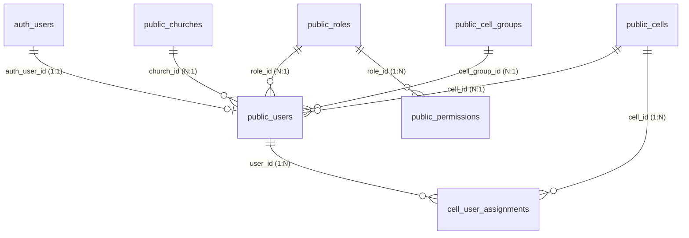

# Supabase Auth Real Implementation Architecture

## 1. Overview

The **CE Operations Portal** implements a robust, production-grade identity, authentication, and authorization architecture integrated directly with **Supabase Auth** and PostgreSQL **Row-Level Security (RLS)**.

The system enforces individual accountability for all staff and leadership roles, strictly preventing shared generic credentials (e.g. `celula.x@gmail.com`) and guaranteeing audit trails across all operational activities.

---

## 2. Canonical Identity & RBAC Architecture

### 2.1 Core Relational Triad

1. `auth.users`: Managed by Supabase GoTrue authentication service. Stores credentials, emails, encrypted passwords, JWT sessions, and metadata.
2. `public.users`: Operational application profile linked via `auth_user_id -> auth.users.id`. Contains business attributes (`church_id`, `cell_group_id`, `cell_id`, `role_id`, `status`, `department_permissions`).
3. `public.roles` & `public.permissions`: Definitive RBAC tables mapping standard application roles to granular module action permissions.

---

## 3. Real Auth Configuration & Lifecycle

### 3.1 Environment Flags

- `VITE_ENABLE_REAL_AUTH=true`: Activates Supabase Auth client workflows. When enabled, silent fallbacks to demo logins (`password: 'demo'`) are completely disabled.
- `VITE_DATA_SOURCE=supabase`: Directs data repositories to persist mutations to Supabase PostgREST endpoints.

### 3.2 Login Flow

1. **Submission**: User submits credentials via the dashboard login form.
2. **Supabase Auth Client**: `supabase.auth.signInWithPassword({ email, password })` validates credentials with GoTrue.
3. **Account Resolution**:
   - Application queries `public.users` matching `auth_user_id = authUser.id` or normalized email.
   - User status is validated. If marked `Suspended`, `Inactive`, or `Locked`, login is blocked with explicit error codes (`AUTH_USER_LOCKED`, `AUTH_USER_INACTIVE`).
4. **Scope & Permission Attachment**:
   - `authRepository.attachPermissions` queries `public.roles`, `public.permissions`, and `public.cell_user_assignments`.
   - Aggregates authorized cell IDs and cell group IDs into the active user session context.
5. **Dashboard Route Redirection**:
   - Cell Leaders & Assistants: Automatically landed on `#cellPortal`.
   - Church Admins & Department Staff: Landed on their respective workspace default route.

---

## 4. Frontend Security Principles

- **No Service-Role Key on Frontend**: The client bundle strictly uses only the Supabase `anon_key`. All administrative provisioning creates user records in `public.users` with status `Pending Auth Setup`.
- **Auto-Session Restore & Listener**: `supabase.auth.onAuthStateChange` listens for token refresh, sign-in, and sign-out events, synchronizing local memory without requiring full page reloads.
- **Session Expiration**: Expired tokens seamlessly refresh in the background or route gracefully back to `#login`.
